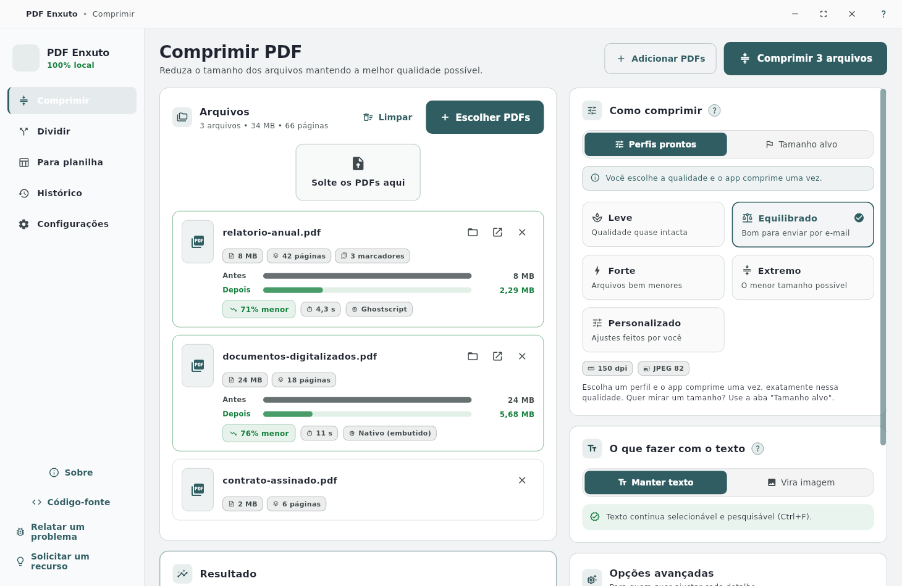
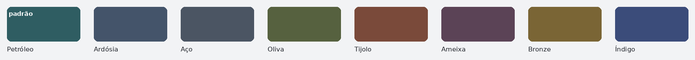

# PDF Enxuto

Compressor e divisor de PDF **100% local** para Linux e Windows. Sem conta, sem nuvem, sem
anúncios — seus arquivos nunca saem do seu computador.

[](https://github.com/vandreborba/pdf_enxuto)
[](LICENSE)
[](https://github.com/vandreborba/pdf_enxuto)



## O que faz

- **Comprimir** de dois jeitos, em abas: por **perfil de qualidade** (Leve, Equilibrado,
  Forte, Extremo) ou por **tamanho alvo** ("até 5 MB", por arquivo ou somando todos).
- **Manter o texto selecionável** ou **virar imagem** (máxima redução), com aviso do que
  cada modo custa.
- **Dividir** por intervalos (`1-3, 7, 10-12`), a cada N páginas, por tamanho máximo,
  extraindo páginas escolhidas ou pelos **marcadores** do documento.
- Vários arquivos de uma vez, com progresso por arquivo, cancelar e histórico do quanto
  você já economizou.
- Ajuda **"?"** em cada opção, em português claro.
- Arraste PDFs para a janela, cole do gerenciador de arquivos ou use `Ctrl+O`.

## Motores

Funciona **sem instalar nada**: o motor próprio (pdfium + leitor/escritor de PDF em Dart)
já vem junto. Se o **Ghostscript** ou o **qpdf** estiverem instalados, o app usa o melhor
disponível — e mostra na interface como instalá-los:

```bash
sudo apt install ghostscript qpdf
```

## Instalação

- **Linux:** baixe o AppImage em [Releases](https://github.com/vandreborba/pdf_enxuto/releases/latest),
  dê permissão de execução e rode — não precisa instalar:

  ```bash
  chmod +x pdf-enxuto_*.AppImage
  ./pdf-enxuto_*.AppImage
  ```

- **Windows:** baixe o ZIP, extraia e execute `pdf_enxuto.exe`.

## Desenvolvimento

```bash
flutter pub get
flutter run -d linux      # ou -d windows
flutter test              # 43 testes
bash .sh/build-desktop.sh   # AppImage local + Windows ZIP (GitHub Actions)
bash .sh/release.sh         # bump + testes + AppImage + Windows + release
```

Cores de destaque (troca em Configurações → Aparência):



## Licença

GPL-3.0. Veja [LICENSE](LICENSE).

Problemas e sugestões: [vandreapps@gmail.com](mailto:vandreapps@gmail.com)
