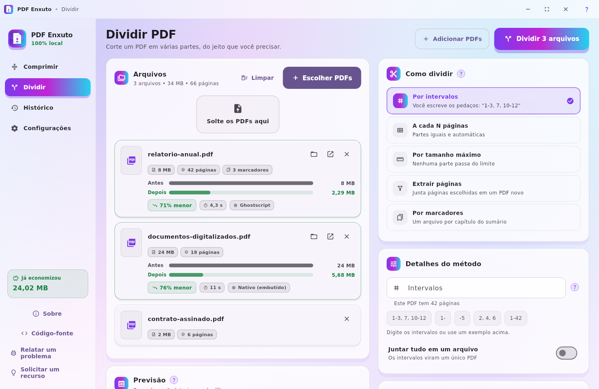
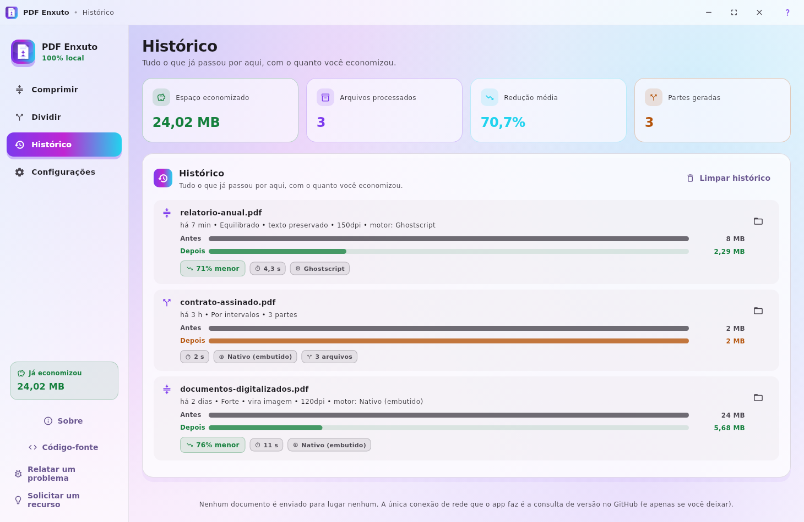
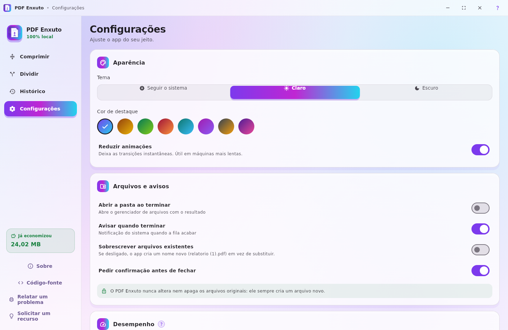
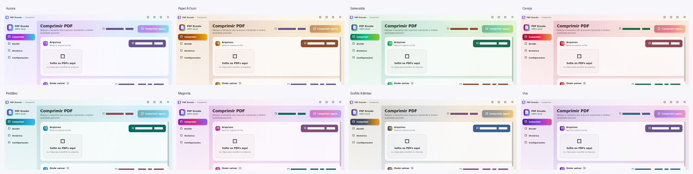

# PDF Enxuto

Compressor e divisor de PDF **100% local** para Linux e Windows. Nenhum arquivo sai do seu
computador: sem conta, sem nuvem, sem anúncios.


[](https://github.com/vandreborba/pdf_enxuto)

**Repositório:** [github.com/vandreborba/pdf_enxuto](https://github.com/vandreborba/pdf_enxuto)


## O que ele faz

- **Comprimir PDF** com quatro perfis prontos (Leve, Equilibrado, Forte, Extremo) ou com
  **tamanho alvo**: você diz "quero até 5 MB" e o app testa qualidade e resolução até caber,
  respeitando um piso de qualidade que você controla.
- **Manter o texto selecionável** ou **virar imagem** (máxima redução). O app avisa o que
  cada modo custa.
- **Dividir PDF** de cinco maneiras: por intervalos (`1-3, 7, 10-12`), a cada N páginas, por
  tamanho máximo, extraindo páginas escolhidas ou usando os **marcadores** do documento.
- **Vários arquivos de uma vez**, com fila, progresso por arquivo, cancelamento e histórico
  do quanto você já economizou.
- Ajuda **"?"** em cada opção, explicando o método em português claro — pensado para quem
  nunca comprimiu um PDF e para quem quer ajustar cada detalhe.
- Arraste PDFs para a janela, cole do gerenciador de arquivos ou use `Ctrl+O`.

## Motores: funciona sem instalar nada

| Motor | Precisa instalar? | Melhor para |
|---|---|---|
| **Nativo (embutido)** | Não — já vem no app | Tudo, especialmente digitalizações no modo "vira imagem" |
| **Ghostscript** | Opcional | Melhor compressão mantendo o texto |
| **qpdf** | Opcional | Otimização estrutural 100% sem perdas |

O app detecta o que existe na máquina, usa o melhor disponível e mostra na interface
**como instalar** os motores opcionais:

```bash
# Debian/Ubuntu
sudo apt install ghostscript qpdf
```

Se um motor falhar, o app cai automaticamente para o próximo — você nunca fica sem resultado.

## Telas

| Dividir | Histórico |
|---|---|
|  |  |

| Configurações | Paletas de cor |
|---|---|
|  |  |

## Instalação

### Linux

Baixe o `.deb` mais recente em [Releases](https://github.com/vandreborba/pdf_enxuto/releases/latest):

```bash
sudo dpkg -i pdf-enxuto_*.deb
sudo apt-get install -f   # se faltar alguma dependência
```

### Windows

Baixe o ZIP, extraia e execute `pdf_enxuto.exe`. Não precisa instalar.

## Desenvolvimento

```bash
flutter pub get
flutter run -d linux     # ou -d windows
flutter test             # 36+ testes (parser de PDF, intervalos, formatação, layout)
```

Gerar ícones e capturas de tela:

```bash
python3 tools/generate_icons.py                       # ícone do app
flutter test --update-goldens test/golden_ui_test.dart # capturas do README
```

### Publicar uma versão

```bash
bash .sh/release.sh          # bump + testes + .deb + Windows (GitHub Actions) + release
bash .sh/build-deb.sh        # só o pacote Linux
bash .sh/build-windows.sh    # só o pacote Windows (via GitHub Actions)
```

## Como funciona por dentro

O coração do app é um **leitor e escritor de PDF em Dart puro** (`lib/services/pdf/`):
tabelas `xref` clássicas, fluxos `xref`, objetos comprimidos (`/ObjStm`), preditores PNG e
reconstrução de índice em arquivos danificados. É ele que permite:

- **dividir** copiando apenas as páginas pedidas, com seus recursos compartilhados —
  sem perdas e sem depender de nenhum programa externo;
- **otimizar a estrutura** (juntar objetos repetidos, remover o que não é usado, recomprimir
  fluxos) mantendo o texto intacto;
- **rasterizar** páginas com o pdfium e remontar o PDF com JPEG (ou 1 bit por pixel no modo
  preto e branco).

Validado com mais de 2.000 PDFs reais (documentos, digitalizações, formulários e arquivos
protegidos por senha): nenhuma falha de leitura ou escrita na amostra, fora os PDFs
criptografados — que o app identifica e explica em vez de tentar abrir.

## Privacidade

- Nenhum documento é enviado para lugar nenhum. O processamento é todo local.
- A única conexão de rede é a consulta da última versão no GitHub, que pode ser desligada
  em **Configurações → Atualizações**.
- O app nunca altera nem apaga o arquivo original: ele sempre cria um arquivo novo.

## Licença

GPL-3.0. Veja [LICENSE](LICENSE).

Feito com Flutter. Problemas e sugestões: [vandreapps@gmail.com](mailto:vandreapps@gmail.com)
ou pelas [issues](https://github.com/vandreborba/pdf_enxuto/issues).
